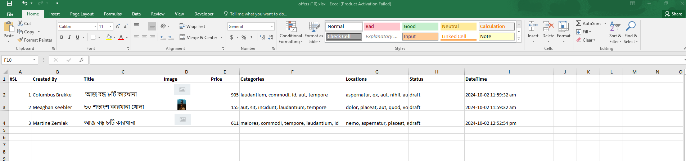

# Laravel CRUD System

## Overview

This Laravel CRUD system is designed to provide an efficient and user-friendly experience for managing data. It implements advanced features such as multi-field filtering, PDF report generation, bulk image entry, global search, and pagination. The goal is to create a comprehensive solution for handling CRUD operations effectively.

## Features

-   **Multi-field Filtering:** Easily filter data using multiple fields for precise results.
-   **PDF Report Generation With Images:** Generate PDF reports without hassle, supporting both Bangla and English fonts.
-   **Excel Export with Images:** Export table data to Excel, including images.
-   **Bulk Entry with Images:** Users can perform bulk data entry, including images, with ease.
-   **Global Search:** A robust global search functionality to find data quickly.
-   **Pagination and Limiting:** Well-organized pagination to manage large datasets efficiently and row limits.
-   **Query Parameters Handling:** Efficiently manage query parameters to avoid common problems.

## Project Screenshots

### Create


### Offers Management


### Update


### Filter Multiple


### Export



### Import


### PDF


### Global Search


## Best Practices:

This application adheres to Laravel best practices, providing a solid foundation for building similar applications.

## Installation

To get started with this project, follow these steps:

1. **Clone the Repository:**

    ```bash
    git clone [repository-url]
    cd [project-directory]

    ```

2. **Install Dependencies:**
   composer install

3. **NPM Install Dependencies:**
   npm install

4. **Create a .env File:**
   cp .env.example .env

5. **Generate Application Key:**
   php artisan key:generate

6. **Run Migrations:**
   php artisan migrate

7. **Set Up Database: Update your .env file with your database credentials:**
   DB_CONNECTION=mysql
   DB_HOST=127.0.0.1
   DB_PORT=3306
   DB_DATABASE=your_database_name
   DB_USERNAME=your_username
   DB_PASSWORD=your_password

8. **Seed the Database (optional): If you have seeders, run:**
   php artisan db:seed

9. **Database Backup(optional): If you have no seeders, then import db:**
   "I have exported the database into a folder named 'DB Backup.' Anyone can import the database without having to run seeders."

10. **Default Login Credentials**
    Email: admin@gmail.com
    Password: password

### Instructions

-   Replace `[repository-url]` and `[project-directory]` with the actual URL of your repository and the directory name of your project.
-   You can also add any additional features or notes that you think are relevant to your project.

Let me know if you need further adjustments!
